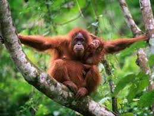

<!DOCTYPE html>
<html lang="de">
<head>
    <meta charset="UTF-8">
    <meta name="viewport" content="width=device-width, initial-scale=1.0">
    <title>Orang-Utans und Klimawandel</title>
    
</head>
<body>
    <header>
        <h1>Orang-Utans und der Klimawandel</h1>
        
Wie die Erderwärmung das Leben dieser faszinierenden Primaten beeinflusst

    </header>

    <nav>
        <a href="#lebensweise">Lebensweise</a>
        <a href="#klimawandel">Klimawandel</a>
        <a href="#hilfe">Was können wir tun?</a>
    </nav>

    <section id="lebensweise" class="intro">
        <h2>Lebensweise der Orang-Utans</h2>
        
Orang-Utans sind hochintelligente Primaten, die in den Regenwäldern Borneos und Sumatras beheimatet sind. Sie verbringen den Großteil ihres Lebens in den Baumkronen und ernähren sich überwiegend von Früchten.

    </section>

    <section id="klimawandel">
        <h2>Klimawandel und seine Auswirkungen</h2>
        
Der Klimawandel hat erhebliche Auswirkungen auf Orang-Utans, insbesondere auf den Lebensraum und die Nahrungsquellen dieser bedrohten Primaten:

        <ul>
            <li><strong>Verlust von Lebensraum:</strong> Häufigere und intensivere Wetterereignisse wie Überschwemmungen und Dürren zerstören den Lebensraum der Orang-Utans. Dies führt zu einem Rückgang der verfügbaren Nist- und Nahrungsgebiete.</li>
            <li><strong>Veränderungen in der Nahrungskette:</strong> Änderungen in der Vegetation und der Verfügbarkeit von Früchten und anderen Nahrungsmitteln beeinträchtigen die Ernährung der Orang-Utans, was zu Nahrungsmangel und schlechterer Gesundheit führen kann.</li>
            <li><strong>Erhöhte Sterblichkeit:</strong> Waldbrände, die durch trockenere Bedingungen häufiger auftreten, gefährden die Lebensräume der Orang-Utans. Aufgrund ihrer langsamen Fortbewegung können sie oft nicht schnell genug fliehen.</li>
            <li><strong>Veränderte Fortpflanzungsraten:</strong> Stressfaktoren durch den Klimawandel beeinflussen die Fortpflanzungsraten der Orang-Utans negativ, was langfristig zu einem Rückgang der Population führt.</li>
        </ul>
        
Diese Herausforderungen verdeutlichen die Notwendigkeit von Schutzmaßnahmen und Anstrengungen zur Erhaltung der Lebensräume der Orang-Utans.

        
    </section>

    <section id="hilfe" class="content">
        <h2>Was können wir tun?</h2>
        
Der Schutz der Orang-Utans erfordert eine Zusammenarbeit auf globaler Ebene. Maßnahmen wie die Unterstützung von Naturschutzorganisationen, die Förderung nachhaltiger Landwirtschaft und der Schutz der Regenwälder können entscheidend sein.

    </section>

    <footer>
        
&copy; 2024 - Bewusst leben für die Natur

    </footer>
</body>
</html>
